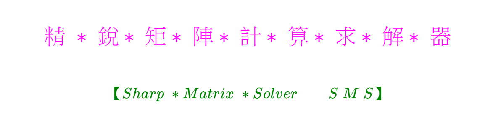
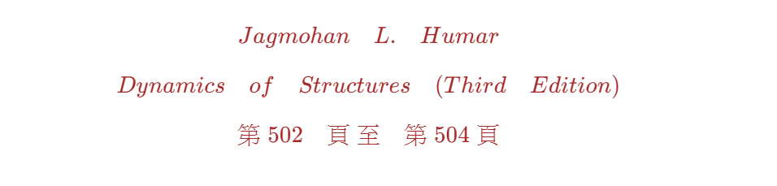
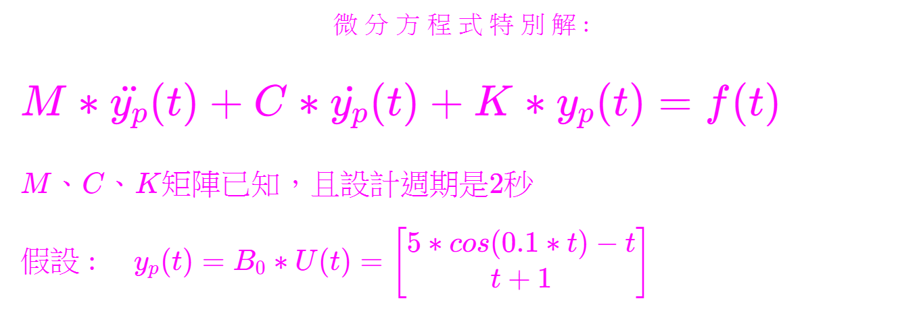
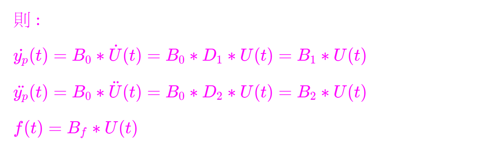
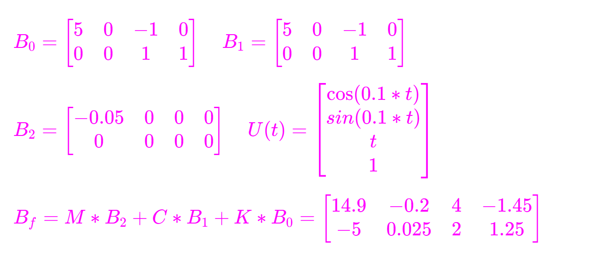

<!--    ConsoleApp6P      -->

<!--   
## \[ { \color{Fuchsia} 精\;*\;銳*\;矩*\;陣*\;計*\;算*\;求*\;解*\;器 }\]
#### \[ {  \color{Green} 【 Sharp \;* Matrix \;* Solver \quad \quad S\; M\; S 】   }\]  
-->  

#  
 
<!--  
##### \[ {  \color{Brown} Jagmohan \quad L. \quad Humar    }\]  
##### \[ {  \color{Brown} Dynamics \quad of \quad Structures \quad (Third \quad Edition)   }\]   
##### \[ {   \color{Brown} 第 \; 502 \quad 頁 \; 至 \quad 第 \; 504 \; 頁  }\]  
-->  

# 
  
<!--   
#### \[{  \color{Fuchsia} 微\;分\;方\;程\;式\;特\;別\;解 :     }\]
# \( { \color{Fuchsia} M \ast \ddot{y_p}(t) + C \ast \dot{y_p}(t) + K \ast y_p(t) = f(t)  } \)
### \( { \color{Fuchsia} M、C、K矩陣已知，且設計週期是2秒 }\) 
### \( { \color{Fuchsia} 假設 : \quad y_p(t) = B_0 \ast U(t) = \begin{bmatrix}  5 \ast cos(0.1 \ast t) - t \\ t + 1 \end{bmatrix}   }\)  
-->  

#  
  
<!--    
### \( { \color{Fuchsia}  則 :  }\) 
### \( { \color{Fuchsia}  \dot{y_p}(t) = B_0 \ast \dot{U}(t) = B_0 \ast D_1 \ast U(t) = B_1 \ast U(t)   }\)  
### \( { \color{Fuchsia}  \ddot{y_p}(t) = B_0 \ast \ddot{U}(t) = B_0 \ast D_2 \ast U(t) = B_2 \ast U(t)   }\)  
### \( { \color{Fuchsia}  f(t) = B_f \ast U(t)   }\)  
-->  

#
  
<!--   
### \( { \color{Fuchsia}  B_0 = \begin{bmatrix}  5 & 0 & -1 & 0 \\ 0 & 0 & 1 & 1  \end{bmatrix} \quad B_1 =   \begin{bmatrix}  5 & 0 & -1 & 0 \\ 0 & 0 & 1 & 1  \end{bmatrix}    }\)  
### \( { \color{Fuchsia}  B_2 = \begin{bmatrix} -0.05 & 0 & 0 & 0 \\ 0 & 0 & 0 & 0  \end{bmatrix} \quad U(t) =   \begin{bmatrix}  \cos(0.1 \ast t) \\ sin(0.1 \ast t) \\ t \\ 1  \end{bmatrix}    }\)  
### \( { \color{Fuchsia}  B_f = M \ast B_2 + C \ast B_1 + K \ast B_0 = \begin{bmatrix}  14.9 & -0.2 & 4 & -1.45 \\ -5 & 0.025 & 2 & 1.25  \end{bmatrix}    }\)  
-->  

